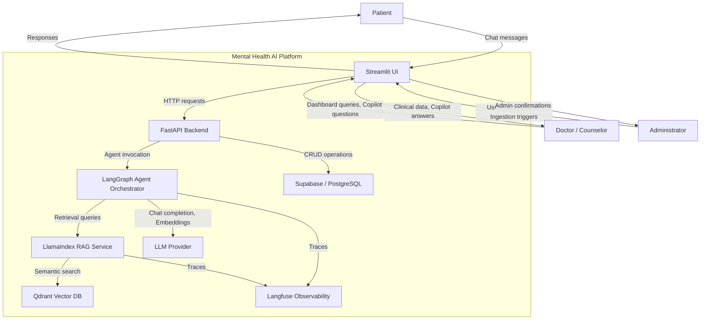
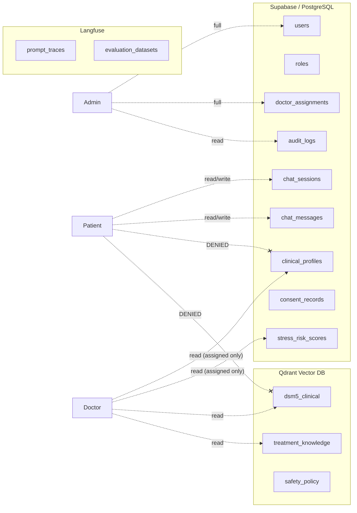
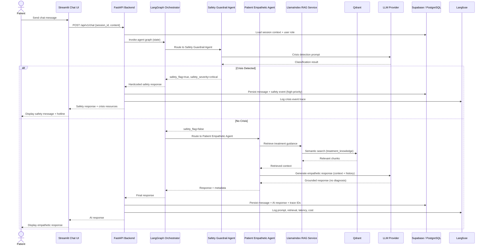
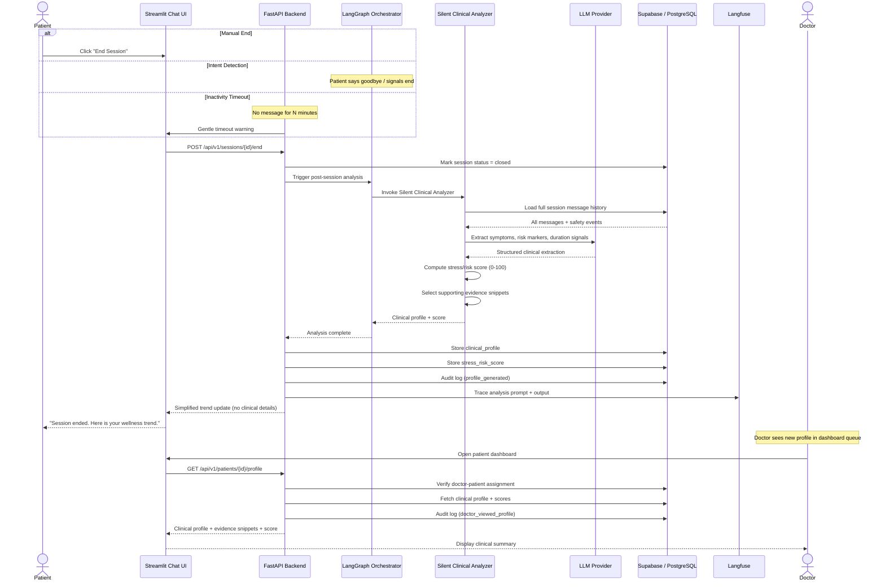
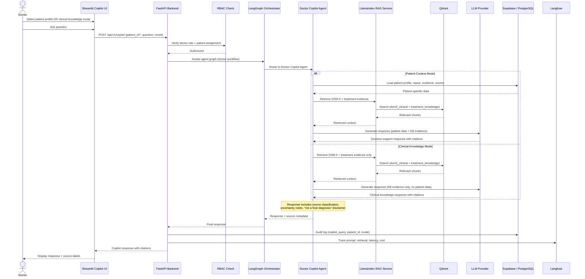
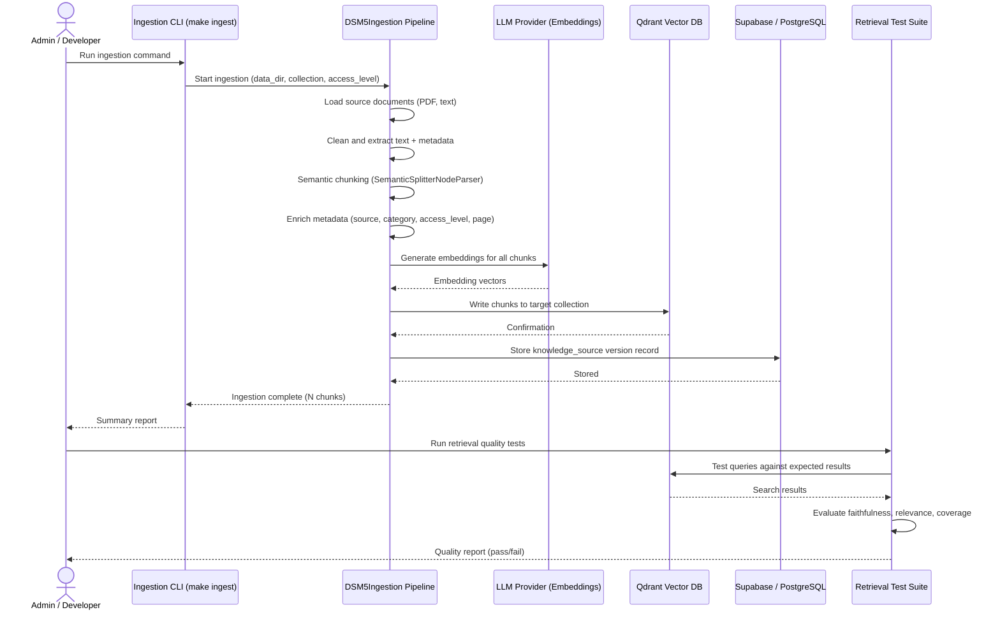
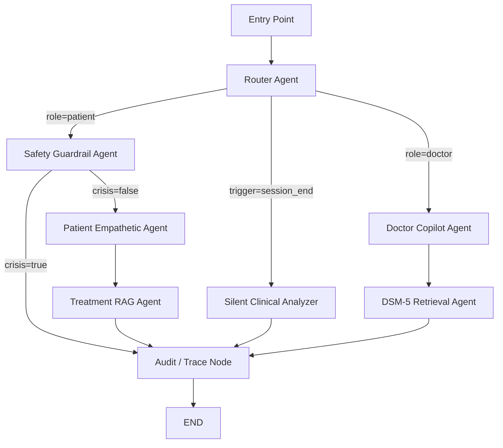
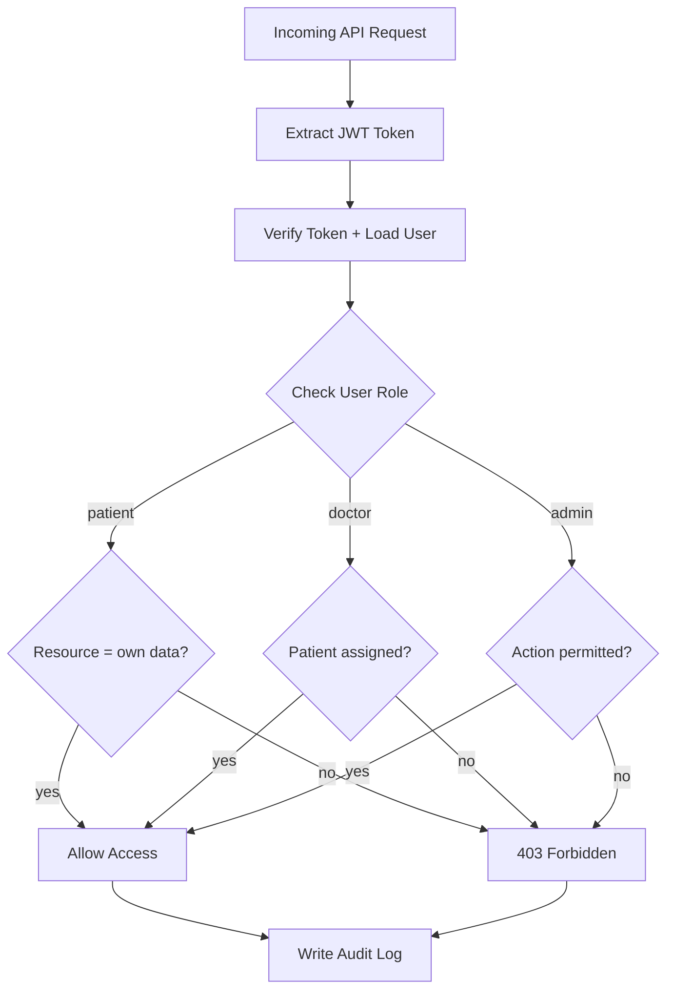
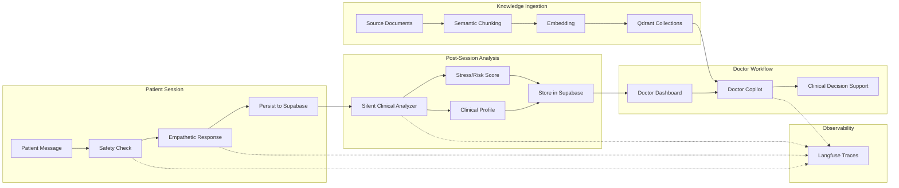

# Data Flow Diagrams (DFD)

> All diagrams in this document are derived from the
> [Software Requirements and Design Specification (SRDS)](./SRDS.md),
> Sections 8, 9, and 10.

---

This document contains **9 diagrams** cover completely all data flows in SRDS.md:

| # | Diagram | Mermaid type | Source SRDS |
|---|---------|-------------|------------|
| 1 | System Context (Level 0) | `graph TB` | Section 8.1 |
| 2 | Data Storage Mapping | `graph LR` | Section 9.1 + 9.2 |
| 3 | Patient Chat Flow | `sequenceDiagram` | Section 10.1 |
| 4 | Session Closure & Clinical Profile | `sequenceDiagram` | Section 10.2 |
| 5 | Doctor Copilot Flow | `sequenceDiagram` | Section 10.3 |
| 6 | Knowledge Ingestion Flow | `sequenceDiagram` | Section 10.4 |
| 7 | Agent Orchestration Graph | `graph TD` | Section 8.2 |
| 8 | RBAC Data Access Flow | `flowchart TD` | Section 11.1 |
| 9 | End-to-End Data Lifecycle | `graph LR` | Tổng hợp | [4-cite-1](#4-cite-1) [4-cite-2](#4-cite-2) [4-cite-0](#4-cite-0) [4-cite-3](#4-cite-3)

---

## 1. System Context Diagram (Level 0)

High-level view of external actors and the platform boundary.

---

## 2. Data Storage Mapping

Where each data entity lives and who can access it.

---

## 3. Patient Chat Flow

**Reference:** SRDS Section 10.1

---

## 4. Session Closure and Clinical Profile Flow

**Reference:** SRDS Section 10.2

---

## 5. Doctor Conversational Copilot Flow

**Reference:** SRDS Section 10.3

---

## 6. Knowledge Ingestion Flow

**Reference:** SRDS Section 10.4

---

## 7. Agent Orchestration Graph

**Reference:** SRDS Section 8.2

Overview of how LangGraph routes requests through agent nodes.

---

## 8. RBAC Data Access Flow

How role-based access control gates every data request.

---

## 9. End-to-End Data Lifecycle

Summary of how data flows from creation to consumption across the entire platform.

---

*End of DFD.md*
